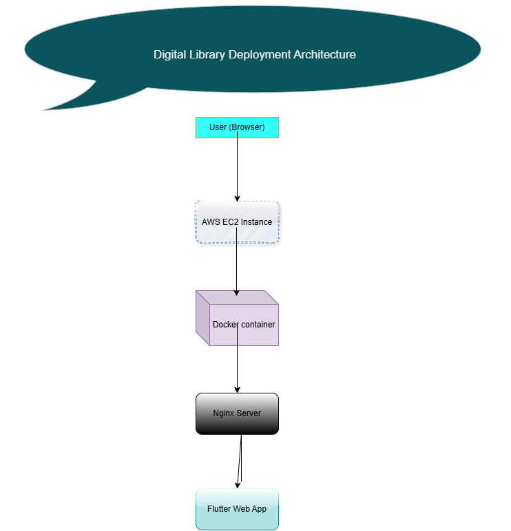
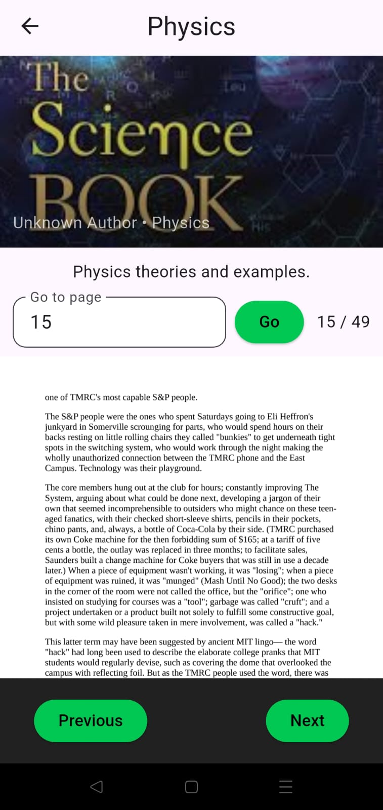
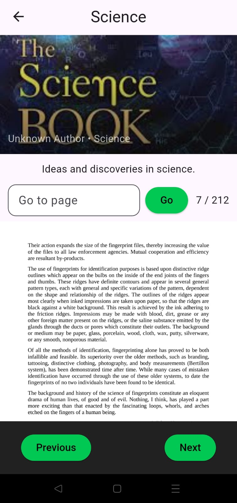

# 📚 Digital Library DevOps Project

A full-stack Flutter Web application deployed on AWS EC2 using Docker and Nginx, with CI/CD powered by GitHub Actions.

---

## 🚀 Live Demo

👉 http://16.171.64.218

---

## 🏗️ Architecture Diagram

---

## 🧱 Tech Stack

- Flutter (Frontend)
- Docker (Containerization)
- Nginx (Web Server)
- AWS EC2 (Cloud Hosting)
- GitHub Actions (CI/CD)

---

## 🔄 CI/CD Overview

This project uses GitHub Actions to automate the deployment pipeline.

- Code push triggers workflow
- Flutter web build is generated
- Docker image is built
- Application is deployed on AWS EC2

---

## ⚙️ Deployment Flow

1. Code pushed to GitHub  
2. GitHub Actions pipeline triggers  
3. Flutter web build generated  
4. Docker image is built  
5. Container runs on AWS EC2  
6. Nginx serves app on port 80  

---

## 🧩 Challenges Solved

- Fixed Docker port binding issues (port 80 conflict)
- Resolved SSH key permission errors on Windows
- Debugged GitHub Actions deployment failures
- Configured Nginx inside Docker container
- Ensured Flutter web build works in production

---

## 🛡️ Production Readiness

This project demonstrates:

- containerized deployment
- cloud hosting on AWS EC2
- CI/CD automation with GitHub Actions
- secure SSH handling
- real-world debugging experience
- architecture documentation

---

## 📸 Screenshots

### Home Screen

### Library View

### UI Example

---

## 📁 Project Structure

digital_library_showcase/
├── .github/workflows/ # CI/CD pipeline
├── assets/ # images and resources
├── docs/images/ # screenshots & diagrams
├── lib/ # Flutter source code
├── web/ # Flutter web config
├── Dockerfile # container setup
├── README.md # documentation
├── pubspec.yaml # dependencies

---

## 📌 Future Improvements

- HTTPS with domain (Route53 + SSL)
- Auto deployment pipeline
- Monitoring (CloudWatch / Grafana)
- Load balancing

---

## 👨‍💻 Author

S.M
